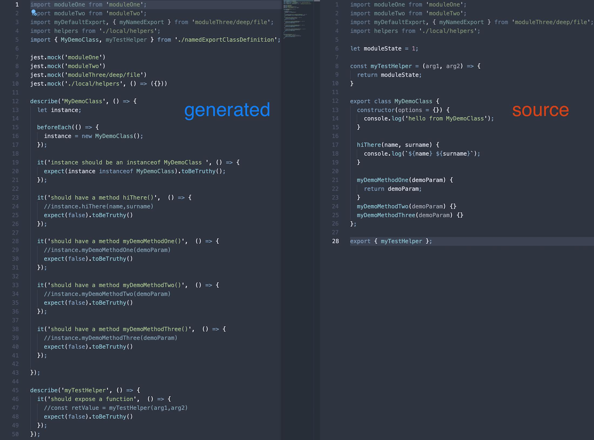
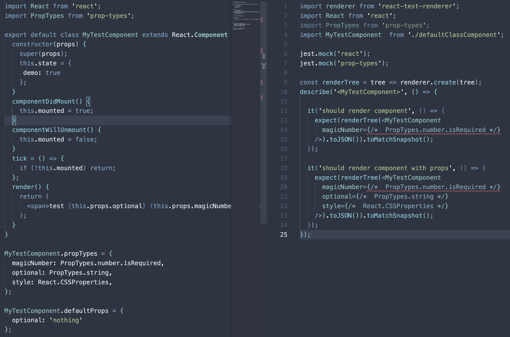

# JestTestGen
 

## 🚀 Try jest-test-gen as a VS Code Extension

**The VS Code extension is the fastest way to generate a unit test file from a source file directly from the IDE**

[Install jest-test-gen Extension](https://marketplace.visualstudio.com/items?itemName=com-egm0121.vs-jest-test-gen)

## About

Automates creation of initial unit test files taking dependencies into account.

Parsing and test generation is avaialable for the following exports:

* Typescript typed React class components 🆕
* Typescript typed Functional components 🆕
* React Functional components 🆕
* React Class based components 🆕
* ES6 Classes default export or named exports
* Exported named functions and arrow functions
* Exported POJOs with methods
* Async functions and methods

This tool will take a js/ts file as input and generate a jest unit test file next to it with all imports mocked and tests stubs for every class method and function exported.

This project is inspired and started as a fork of [jasmine-unit-test-generator](https://github.com/FDIM/jasmine-unit-test-generator)

## Preview

Basic ES6 Class example: 

React Component example:

## Usage

### Installation

run `npm i -g jest-test-gen`

### Basic Usage

run `jest-test-gen <path-to-file>`

## Development

It's probably best to:

* add an input file in `spec/fixtures` folder test.js
* add a snapshot test for the input spec in `integration.spec.ts`
* verify that the snapshot is actually the wanted test output before commiting the updated snapshot.

Alternavely, you can:

* run `npm link`
* run `npm run build:dev`
* run `jest-test-gen <option>` in your project of choice

## Release
run `npm run build`
run `npm publish`
